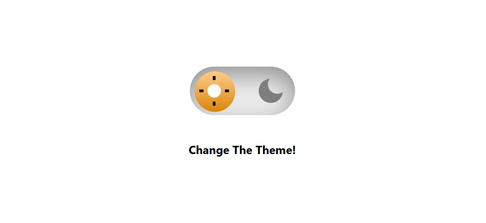
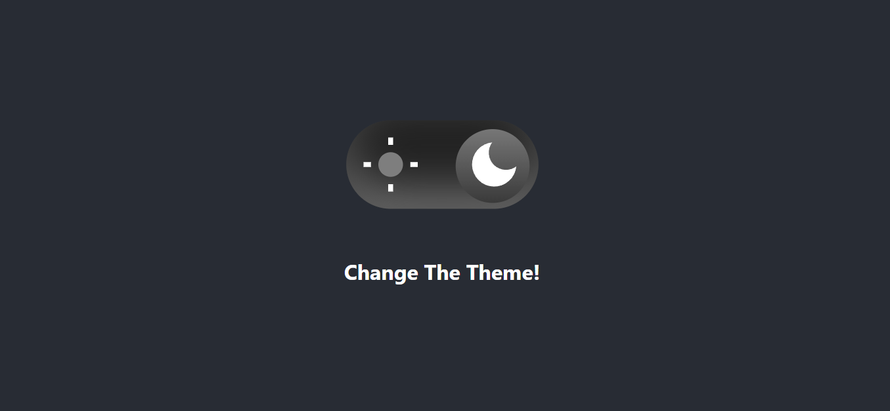

# 🌗 React Theme Switcher (Light / Dark Mode)

A modern React application that allows users to switch between Light and Dark themes with smooth transitions. The selected theme is saved in localStorage so it persists even after page refresh.

---

## 🚀 Features

- 🌞 Light Mode & 🌙 Dark Mode toggle
- 💾 Theme persistence using localStorage
- 🎨 Smooth CSS transitions
- ⚛️ Built with React Hooks
- 📱 Responsive and clean UI

---

## 🛠️ Tech Stack

- React
- JavaScript (ES6+)
- CSS3
- HTML5

---

## 📸 Preview

> Add a screenshot of your project here  
>  
> 
> Example:
